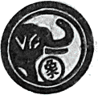
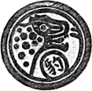
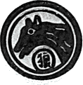
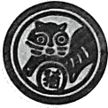

# 斗兽棋 (Animal Chess)

## Introduction

**Animal chess** is a two-player strategy game played by _kids_ on a gameboard resembling a make-believe jungle.

Each player controls 8 game pieces representing different animals of various ranks. Stronger-ranked animals can capture ("eat") animals of weaker or equal rank, with the exception of the elephant, which can be killed by the rat but not the other way round. The animal rank is as follows:
| Rank | Animal | Piece |
| ----------- | ----------- | ----------- |
| 8 | Elephant |  |
| 7 | Lion |  |
| 6 | Tiger |  |
| 5 | Leopard |  |
| 4 | Wolf |  |
| 3 | Dog |  |
| 2 | Cat |  |
| 1 | Rat |  |

To win, you have to manouevre one of your animal pieces into the opponent's "den" **or** capture all of the opponent's pieces.

The origins of the game is _unknown_ but legend has it that it descended upon our shores through the kids of our Chinese forefathers.

## Technology

HTML, CSS and JavaScript

## Gameplay

At the start of your turn, you may either _move_ an animal piece **and/or** capture an opponent's piece.

### Moving a piece

- **Basic move**: All pieces can only move 1 square horizontally or vertically (no diagonal movements). But note the special rules concerning the lion and the tiger below.
- **Den**: No animal can enter its own den.
- **Trap**: You may move your piece into and out of any trap but if your animal enters into any of the **opponent's** trap squares, it is reduced in rank to 0. This means that it can be captured by _any_ of the opponent's pieces for as long as your piece remains in the opponent's trap. Your animal will have its normal rank restored when it exits the opponent's trap.
- **River**: There are special rules regarding the river (blue squares):
  - _Only_ the **rat** can enter the river.
  - Both the **lion** and the **tiger** can **jump** over the river, provided there is no rat piece (of either player) in any of the intervening water squares.
  - When jumping, the lion and the tiger can capture an opponent's piece of lower rank on the other side of the river (see rules on capturing below).

### Capturing a piece

- **How to capture?** You may only capture an opponent's piece if your animal is **equal to or higher in rank** than the opponent's animal.
- **Special rules**: There are special rules regarding capturing of opponent's pieces:
  - The rat can capture an elephant, but only from land and **not from the river**. This is based on an ancient folktale where elephants are notoriously afraid of rats, which can enter the elephants ears and gnaw its brain to death (gore!). The elephant **cannot** capture the rat under any circumstances.
  - As the rat is the only animal that can enter the river, it cannot be captured by any piece from land. A rat in the water can _only_ be captured by the opponent's rat **in the water**.
- A captured piece is **removed** from the gameboard.

## Next Steps (Icebox)

- Implement feature that rotates the gameboard when player turn shifts (enhance player experience)
- Allow players to play with variations included in the game to reduce the probability of ties (see variations [here](<https://en.wikipedia.org/wiki/Jungle_(board_game)#:~:text=opponent%27s%20trap%20square.-,Minor%20variations,-%5Bedit%5D>))

## References

- https://www.youtube.com/watch?v=Qv0fvm5B0EM
- https://www.youtube.com/watch?v=aqNvMSuLuE0
